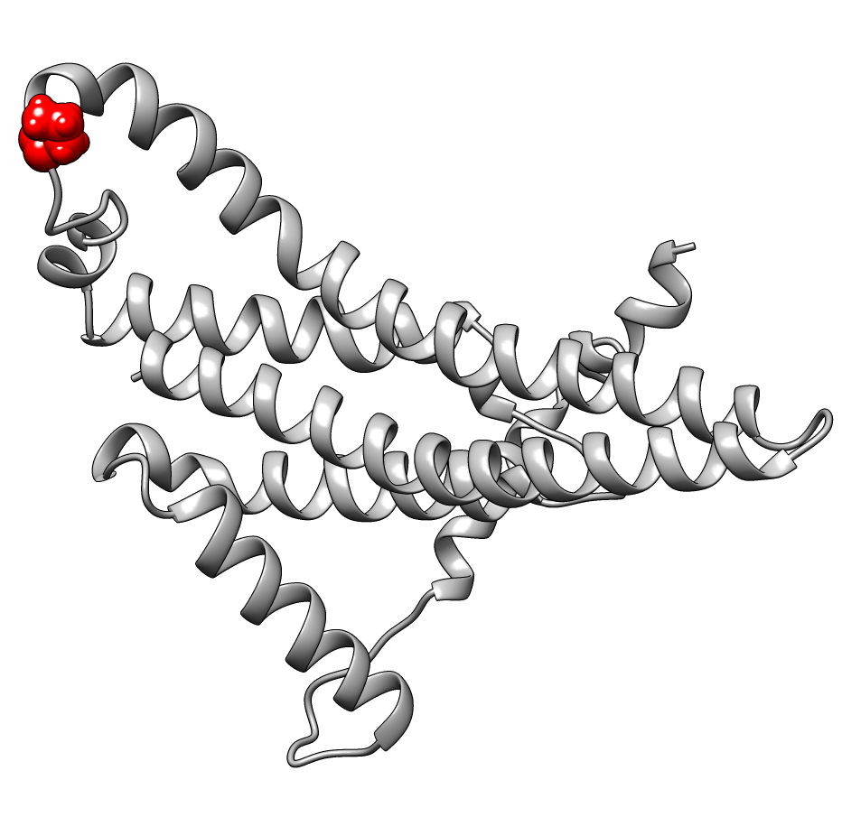
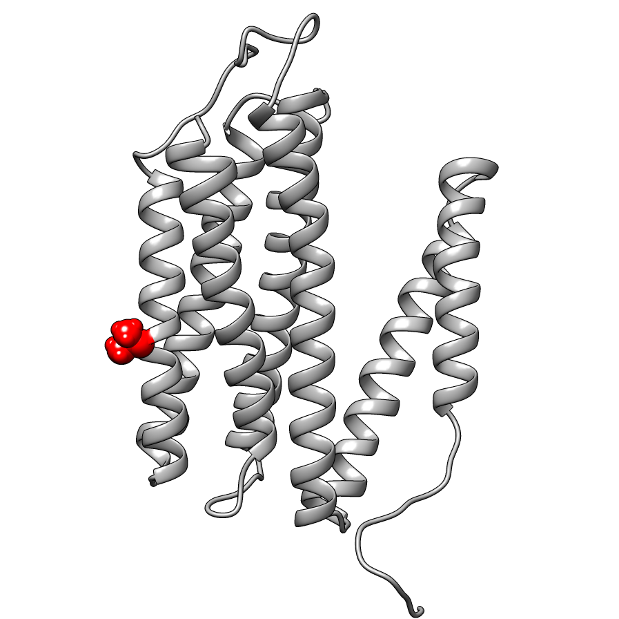
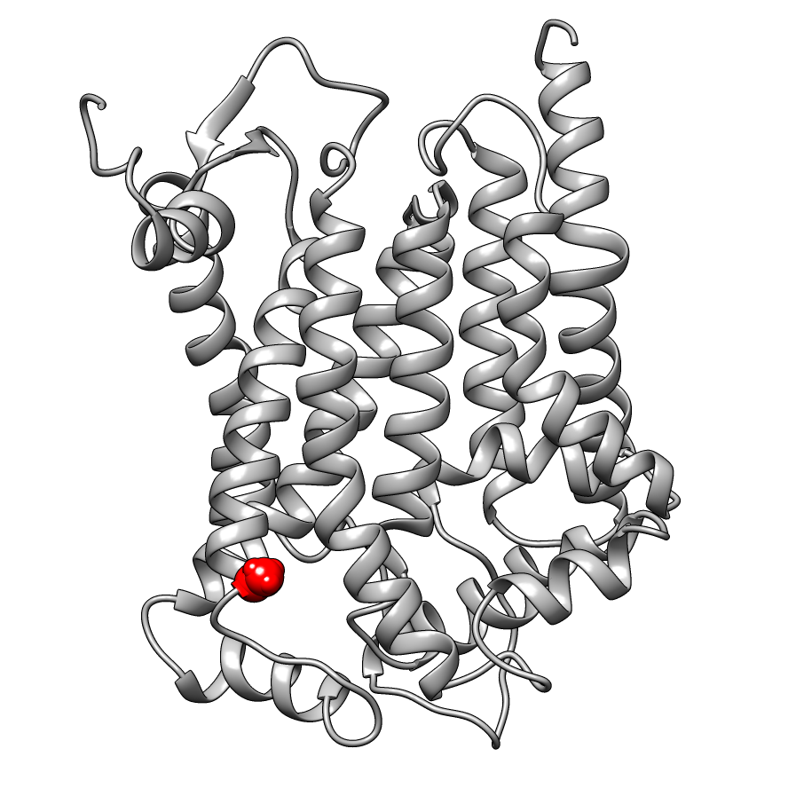
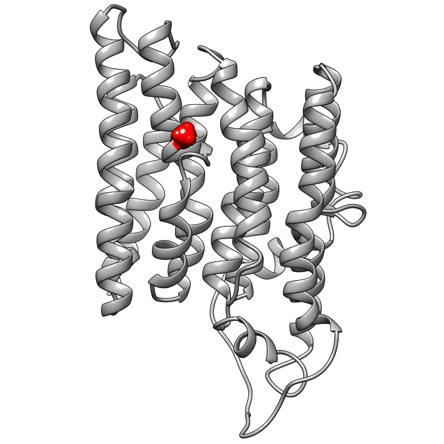
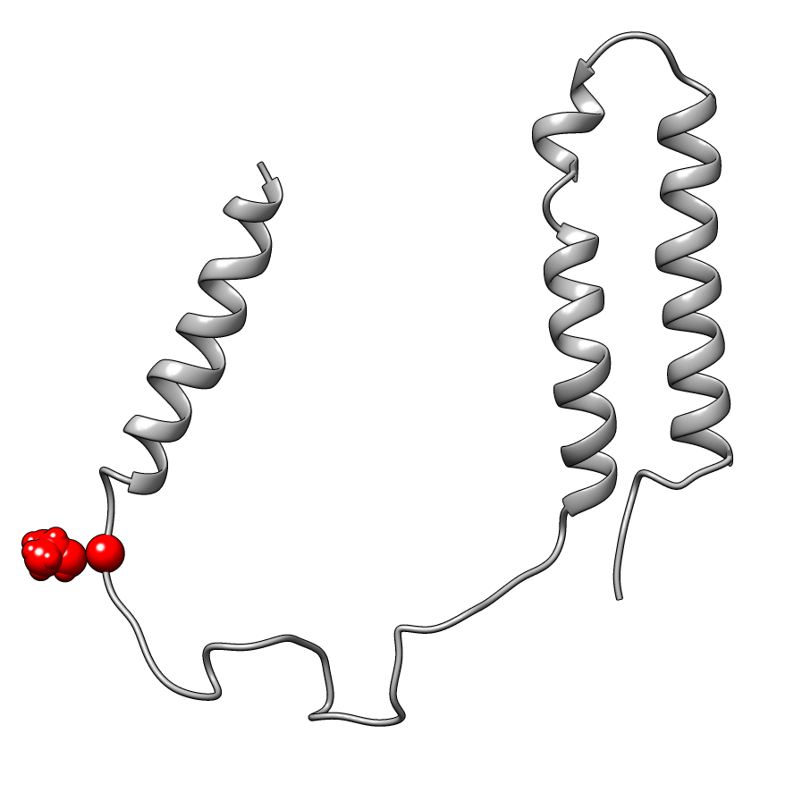
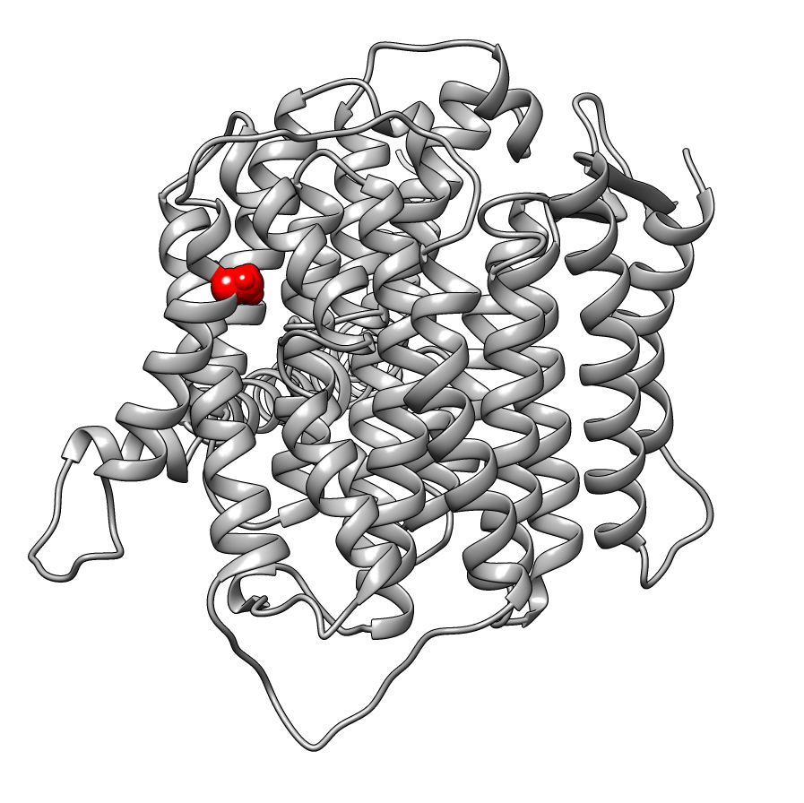
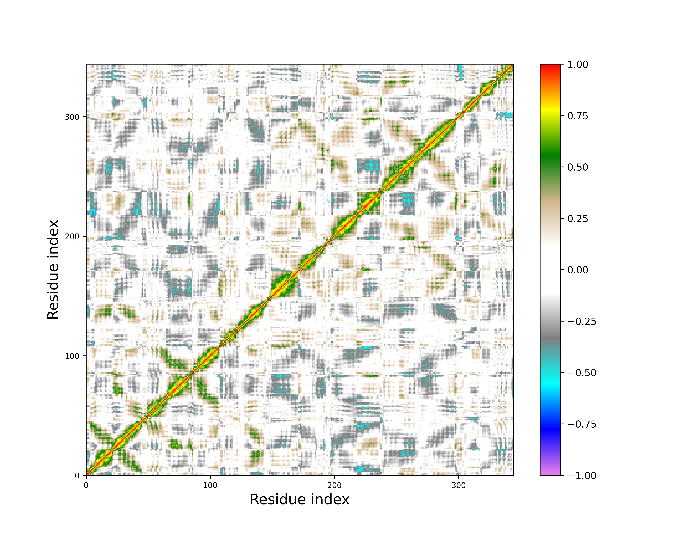
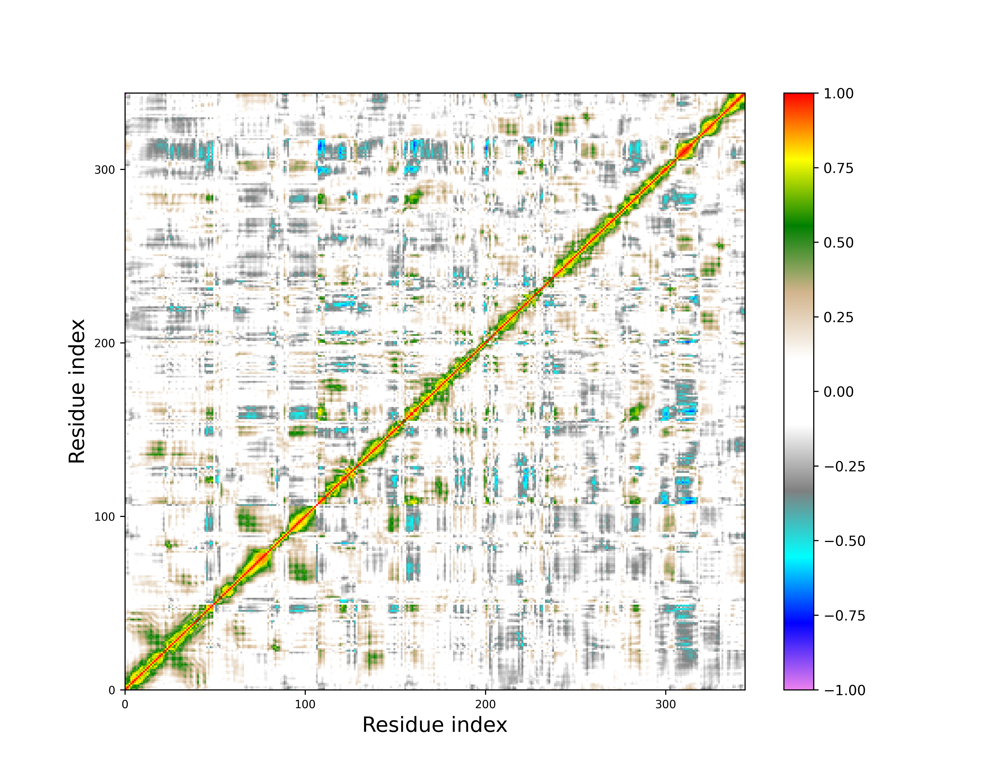
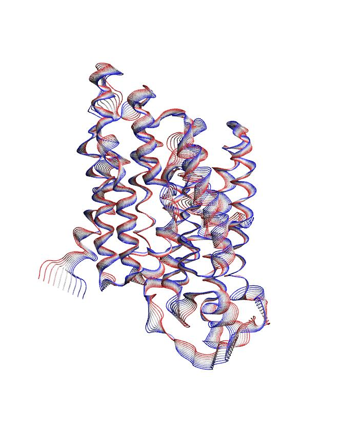
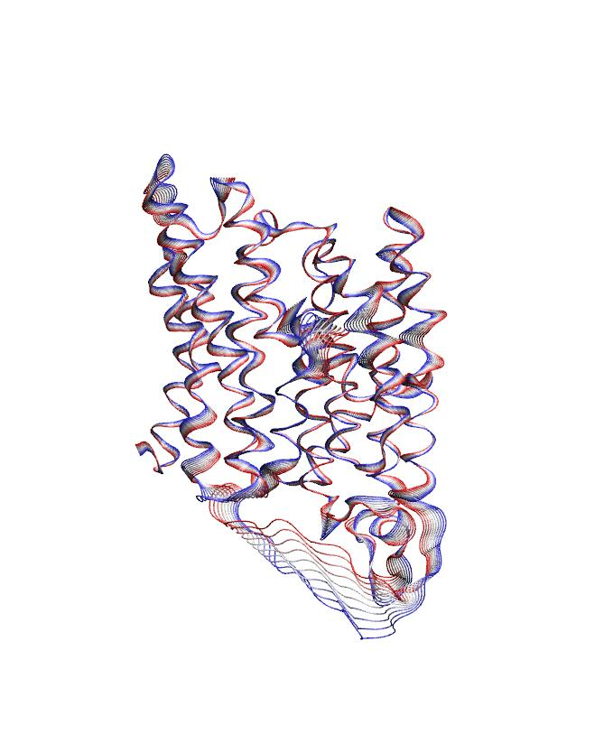

# My master thesis project 🐢
[](MasterThesisITA.pdf)
[]()

This is the repository of my master thesis project titled:  
> :uk: Next Generation Sequencing of the Caretta caretta mitogenome for identification of polymorphisms and analysis of their functional effect on protein structures
> 
> :it: Next Generation Sequencing del mitogenoma di Caretta caretta per l’identificazione di polimorfismi e analisi del loro effetto funzionale sulle strutture proteiche

The purpose of this thesis is to identify all regions harboring polymorphisms in the entire mitogenome of sea turtles *Caretta caretta* sampled in the central Mediterranean Sea and to study the effects of coding variants on protein structure and function to assess their biological significance. For this purpose, the University of Florence sampled 74 individuals from different Italian sites and performed their sequencing using Illumina paired-end NGS techniques.

> **Whole mitochondrial genome sequencing provides new insights into the phylogeography of the Mediterranean loggerhead sea turtle (Under Review)** Livia Tolve*, Alessio Iannucci*, Luisa Garofalo, Andrea Ninni, Andrea Capobianco Dondona, Ilaria Ceciarini , Cristiano Cocumelli, Alessandra De Lucia, Mattia Falconi, Angela Formia, Federico Iacovelli, Cecilia Mancusi, Erica Marchiori, Letizia Marsili, Toni Mingozzi, Stefano Nannarelli, Chiara Natali, Giuliana Terracciano, Marco A. L. Zuffi, Andrea Novelletto, Claudio Ciofi

## Requirements
To install this repository run this commands:
```
git clone https://github.com/andreeedna/MasterThesisProject
cd MasterThesisProject

#this is for rerun the same analysis
chmod +x requirement.sh
./requirement.sh
```

## *Caretta caretta*
The loggerhead sea turtle (*Caretta caretta*) inhabits the tropical and subtropical waters of the Atlantic, Pacific and Indian Oceans, extending its range to the temperate Mediterranean Sea where is the most common sea turtle and is found both as a visitor and nesting species. This species exhibit a natal homing behavior, whereby adult females mate in open waters and land to lay their eggs on or near the same beaches where they were born decades before.\
The existence of Mediterranean populations implies that they have withstood ongoing climatic fluctuations, a result also proposed for some subtropical species currently found in the Mediterranean (Wilson and Eigenmann Veraguth, 2010). As poikilothermic vertebrates, sea turtles should have been strongly impacted by such fluctuations, given the temperature dependence of many aspects of their biology (phenology, migration, reproduction, and sex determination) (Mazaris et al., 2004; Hawkes et al., 2007). These conditions have the potential to drive the frequency of new positively selected mutations and the surrounding genomic regions.\
The strong functional conservation of proteins encoded by the mitogenome allows an inference of their three-dimensional structure from that obtained experimentally in related species. This opens new possibilities for the understanding of variant properties: based on the 3D model of the protein, all substitutions can be evaluated in the appropriate protein context, which includes insertion into the phospholipid bilayer, solvent exposure, and interaction with other subunits in multiprotein complexes (Somero, 2010).

## NGS analysis
To study the presence of polymorphic variants and analyze their effect on the three-dimensional protein structures, 73 individuals of *Caretta caretta* sampled in the Mediterranean Sea were sequenced using the Illumina sequencing platform. We analyzed the quality of the fastq files using FastQC software and trimmed the read using Trimmomatic software and then proceeded with read mapping: the sequences were aligned to the RefSeq reference mitochondrial genome (Maglott et al., 2000), and using software, all variants that differed from the reference genome were identified and annotated using SnpEff. The variant calling procedure resulted in the identification of 24 unique variants that were mapped to genes encoding tRNA (Cys and Gly), 16S rRNA, genes encoding protein subunits of mitochondrial complexes, and D-loop.\
The project further aims to analyze the effect of missense variants on protein structures, all non-synonymous variants identified were considered and analyzed in their structural context.

## Molecular Modelling
To study of the effect of variants, the 6 subunits carrying missense variants were modeled: ATP6, COX3, CYTB, ND2, ND3 and ND5. For each sequence, templates were selected from the PDB (Berman et al., 2000) through BLAST (Altshul et al., 1999), and modeling was performed by homology modeling techniques through Modeller software (Webb and Sali, 2016) using the UCSF Chimera GUI (Pettersen et al., 2004); finally they were mutated through Foldx software. All mutations associated a slight change in free energy, not having a strong impact on protein structure destabilization, except for the ND2 subunit that exhibited a change of 3.04807 Kcal/mol.

| ATP6                     | COX3                     | CYTB                     |
| ------------------------ | ------------------------ | ------------------------ |
|  |  |  |

| ND2                      | ND3                      | ND5                      |
| ------------------------ | ------------------------ | ------------------------ |
|    |    |    |

## Molecular Dynamics and Analysis
To study the effect of mutation on the protein structure of the ND2 subunit, we performed two simulations of the protein subunit in the wild-type and mutated form, which were analyzed by PCA and compared. Molecular dynamics trajectory analyses were performed with GROMACS and Python/Perl scripts ([Tutorial](http://www.mdtutorials.com/gmx/membrane_protein/index.html)).
Analysis of secondary structure evolution revealed few differences between the two subunits, which are limited principally to the C-terminal portion and only for a limited simulation time, consistent with rearrangements that can occur in terminal portion of proteins.\
The analysis of the cross-correlation matrices and the projection of the principal motion described by the first eigenvector showed that the mutated subunit exhibits greater stiffness than the wild-type, showing mobility only in the solvent-exposed loop region.

| WT cross-correlation                                                 | MUT cross-correlation                                                  | 
| -------------------------------------------------------------------- | ---------------------------------------------------------------------- | 
|  |  | 

In conclusion, the ND2 subunit is able to absorb the effect of the Ala103Thr mutation without affecting functionality although a slight alteration of its mobility.

| WT PCA                                           | MUT PCA                                            | 
| ------------------------------------------------ | -------------------------------------------------- | 
|  |  | 

